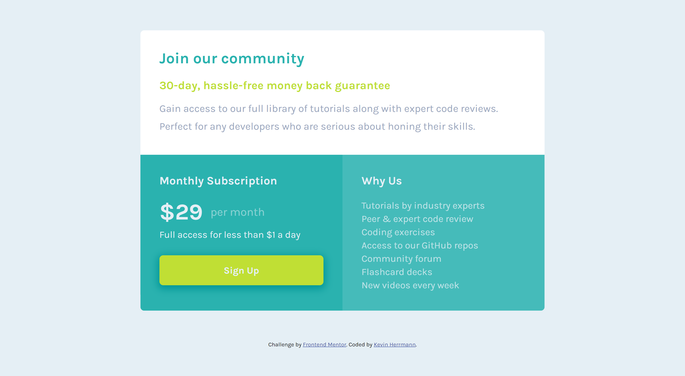

# Frontend Mentor - Single price grid component solution

This is a solution to the [Single price grid component challenge on Frontend Mentor](https://www.frontendmentor.io/challenges/single-price-grid-component-5ce41129d0ff452fec5abbbc). Frontend Mentor challenges help you improve your coding skills by building realistic projects. 

## Table of contents

- [Overview](#overview)
  - [The challenge](#the-challenge)
  - [Screenshot](#screenshot)
  - [Links](#links)
- [My process](#my-process)
  - [Built with](#built-with)
  - [What I learned](#what-i-learned)
  - [Continued development](#continued-development)
  - [Useful resources](#useful-resources)
- [Author](#author)
- [Acknowledgments](#acknowledgments)

## Overview

### The challenge

Users should be able to:

- View the optimal layout for the component depending on their device's screen size
- See a hover state on desktop for the Sign Up call-to-action

### Screenshot

### Links

- Solution URL: [My solution code](https://github.com/kevinx9000/single-price-grid-component)
- Live Site URL: [My live site](https://kevinx9000.github.io/single-price-grid-component)

## My process

### Built with

- Semantic HTML5 markup
- CSS custom properties
- CSS Grid
- Flexbox
- Mobile-first workflow

### What I learned

I started with a mobile-first workflow. As I moved into the responsive design, that's when I added the CSS Grid (for the first time while working on these FrontEnd Mentor projects).
Additionally, I tried to stay exclusively with rem units, but that caused some grief as I went into responsive design. Everything looked too small on larger screens; then when I tried to adjust the rem units for the breakpoints, then everything seemed too big!

### Continued development

I need more hands-on practice with CSS Grid, and determining when to implement it in the creation process.
I also need more practice with rem and em units, so that they adjust automatically for responsive design, as opposed to me having to make multiple manual adjustments while creating breakpoints.

### Useful resources

- [Grid tutorial on freecodecamp.org](https://www.freecodecamp.org/news/css-grid-tutorial-with-cheatsheet/)

## Author

- Frontend Mentor - [@kevinx9000](https://www.frontendmentor.io/profile/kevinx9000)

## Acknowledgments
